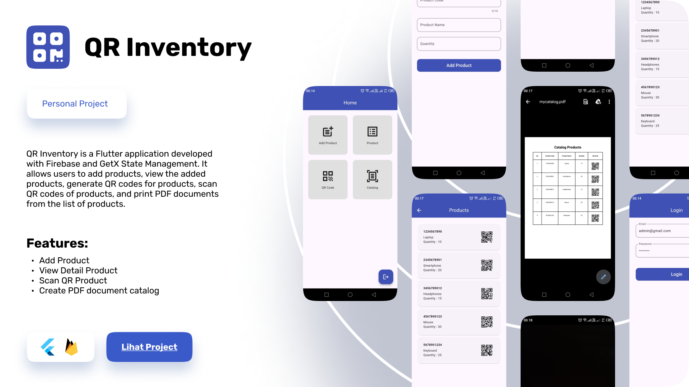

# QR Inventory Mobile App
 

## About The Project
QR Inventory is a Flutter application developed with Firebase and GetX State Management. It allows users to add products, view the added products, generate QR codes for products, scan QR codes of products, and print PDF documents from the list of products.
<br />

<div align="center">
      
</div>


## Features

- [ ] Add Product
- [ ] View Detail Product
- [ ] Scan QR Product
- [ ] Create PDF Document Catalog

## How to Run Project

First, clone this repository:

- Open your terminal or command prompt.
- Navigate to the directory where you want to clone the repository.

```bash
git clone https://github.com/yondikavl/QR-Inventory-Mobile-App.git
```

Second, Navigate to the Project Directory:

```bash
cd QR-Inventory-Mobile-App
```

Third, Ensure Flutter is Installed:

- Make sure you have Flutter installed on your machine. You can check by running

```bash
flutter --version
```

Fourth, Install Dependencies:

- Run the following command to install all the dependencies listed in the pubspec.yaml file

```bash
flutter pub get
```

Fifth, Configure Firebase:

- Follow the Firebase setup guide https://firebase.flutter.dev/docs/overview/

sixth, Run the Project:

- Connect a physical device via USB or start an emulator.
- Run the following command to start the project.

```bash
flutter run
```

## Getting Started

This project is a starting point for a Flutter application.

A few resources to get you started if this is your first Flutter project:

- [Lab: Write your first Flutter app](https://docs.flutter.dev/get-started/codelab)
- [Cookbook: Useful Flutter samples](https://docs.flutter.dev/cookbook)

For help getting started with Flutter development, view the
[online documentation](https://docs.flutter.dev/), which offers tutorials,
samples, guidance on mobile development, and a full API reference.
